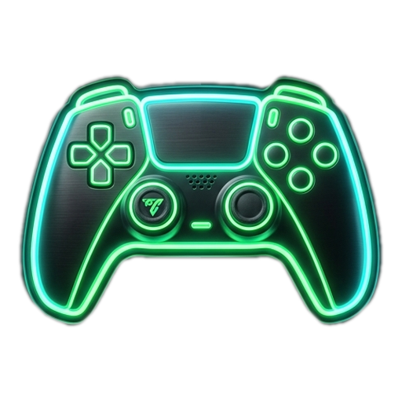

# DuoPad

**Turn Any Smartphone into a Zero-Latency Wireless Xbox 360 Controller for PC Games**

*Play EA Sports FC 24/25/26, FIFA, GTA V, Rocket League, Forza, and 2-Player Co-Op with Friends — No Physical Controller Needed!*

[-purple.svg)](#)

---

## 🌟 Live Demo & Download
Visit the official DuoPad website to download the Windows installer:
👉 **[https://duopad-web.vercel.app](https://duopad-web.vercel.app)**

---

## 💡 Key Features
* **Zero Phone App Downloads** — No APK or Play Store download needed. Simply scan the QR code on your PC screen with your phone's camera to play instantly in Chrome or Safari.
* **Player 1 & Player 2 Dual Co-Op** — Connect two phones simultaneously (Player 1 = Cyan, Player 2 = Magenta) for 1v1 local matches or split-screen co-op.
* **Official Hardware Emulation** — Uses the industry-standard Nefarius ViGEmBus virtual bus driver. Windows natively detects two Xbox 360 controllers with zero configuration.
* **Ultra-Low Latency (<1ms)** — Direct binary WebSocket packets transmission over local Wi-Fi.
* **Works with All PC Games** — Fully compatible with EA App, Steam, Epic Games Store, and Xbox Game Pass.

---

## 📂 Project Structure
* `duopad/` — Windows Desktop Hub, Python WebSocket server, ViGEmBus driver bridge, virtual controller HTML templates.
* `duopad-web/` — Modern responsive landing page deployed on Vercel (`duopad-web.vercel.app`).

---

## 📜 License
Licensed under the [MIT License](duopad/LICENSE).
